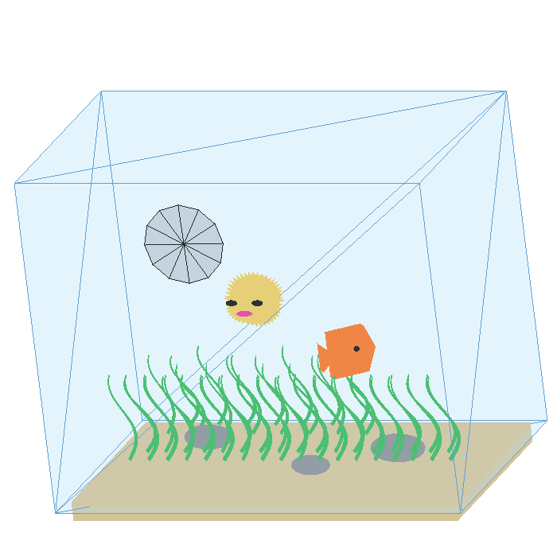
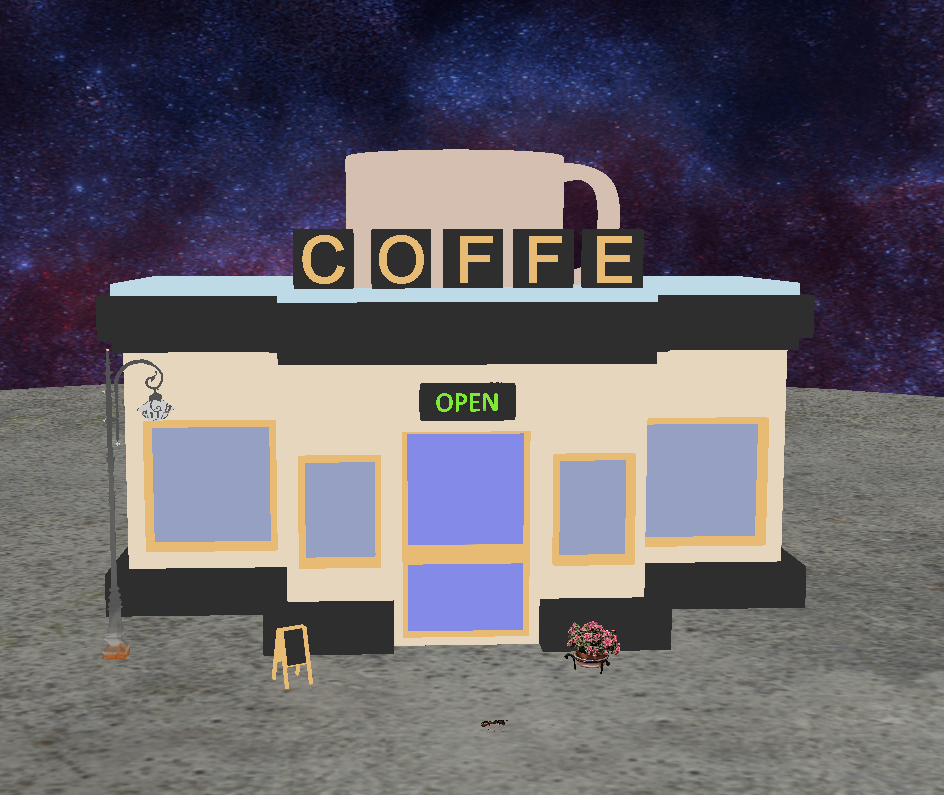

# computer-graphics
Repo to organize the assignments developed for course SCC0250 - Computer Graphics on Computer and Mathematical Sciences Institute of the University of São Paulo (ICMC-USP).

The repo consists of different 3D scenes each in its own folder. Scenes were developed using Python and OpenGL.

# Scene 1
For scene one we couldn't use camera, textures or shaders and we self-imposed the limitations of writing our own code for vertex and faces generations, that meant not using third party 3D modelling software. The scene is an aquarium with a spinning filter, swimming fish and inflating pufferfish.

# Scene 2 

This project is a scene developed in Python using OpenGL, the scene represents a small coofee shop environment with multiple texture objects, camera movement and keyboard interactions. 

## Composition 

- Textured '.obj' models
- Camera movement using keyboard and mouse
- Perspective, projection and view matrix control
- Multiple objects in the scene:
  * Bakery environment
  * Table
  * Cake
  * Bread
  * Mixer
  * Lamp
  * Flower
  * Ant
  * Light pole
  * Floor and sky
- Object placement using `placements.txt`

## Controls 

### Camera

| Key/Mouse | Action | 
|----------|---------|
| `W` | Move forward |
| `S` | Move backward |
| `A` | Move left |
| `D` | Move right |

### Object interaction 

| Key/Mouse | Action | 
|----------|---------|
| `B` | Rotate the cake |
| `F` | Rotate the Flower |
| `T` | Scale and move the bread |
| `Left Arrow` |  move the ant left  |
| `Right Arrow` | Move the ant right |
| `P` | mesh mode |

## Run 
If you want to run using virtual environment, can just use `requirements.txt` to install the required libraries.

# Scene 3

This project is a scene developed in Python using OpenGL, the scene represents a small coofee shop environment with multiple texture objects, camera movement and keyboard interactions. Scene 3 has added lighting to scene 2

## Composition 

- Textured '.obj' models
- Camera movement using keyboard and mouse
- Perspective, projection and view matrix control
- Multiple objects in the scene:
  * Bakery environment
  * Table
  * Cake
  * Bread
  * Mixer
  * Lamp
  * Flower
  * Ant
  * Light pole
  * Floor and sky
- Object placement using `placements.txt`

## Controls 

### Camera

| Key/Mouse | Action | 
|----------|---------|
| `W` | Move forward |
| `S` | Move backward |
| `A` | Move left |
| `D` | Move right |

### Object interaction 

| Key/Mouse | Action | 
|----------|---------|
| `K` | Move the ant and the car left  |
| `L` | Move the ant and the car right |
| `P` | mesh mode |
| `1` | Toggle inside lamp light |
| `2` | Toggle inside neon sign light |
| `3` | Toggle outside lamp post light |
| `4` | Toggle car headlights light  |
| `0` | Toggle global ambient light |
| `N` | Decreases specular reflexion  |
| `B` | Increases specular reflexion |
| `C` | Decreases diffuse reflexion  |
| `V` | Increases diffuse reflexion |
| `Z` | Decreases ambient light intensity  |
| `X` | Increases ambient light intensity |

## Run 
If you want to run using virtual environment, can just use `requirements.txt` to install the required libraries.
