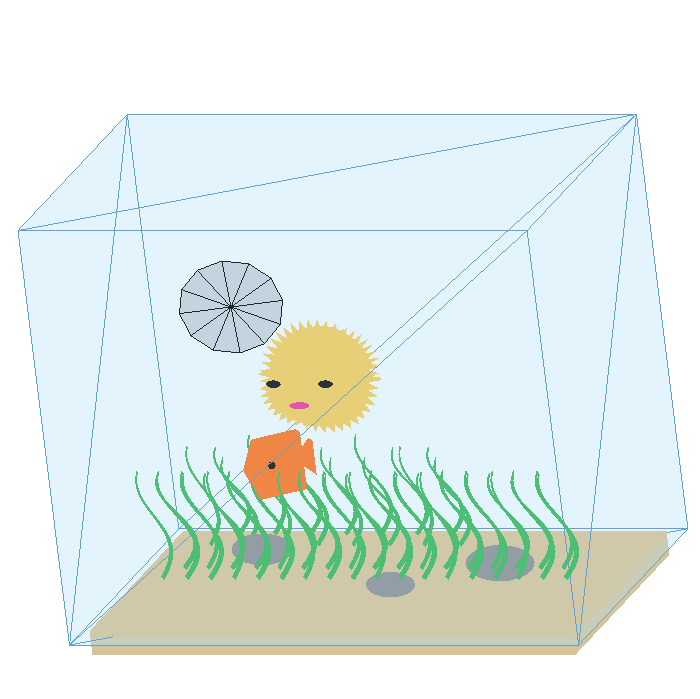

# Scene 1

The scene is an aquarium with a spinning filter, swimming fish and inflating pufferfish.

## Execution
To run the scene simply download all dependencies and run aquarium.py

## Controls
Z and A - moves fish through the aquarium

A and S - inflates and deflates pufferfish

D - toggles filter fan rotation

P - toggles mesh mode

## Limitations

We couldn't use camera, textures or shaders and we self-imposed the limitation of writing our own code for vertex and faces generations, that meant not using third party 3D modelling software.

## Files
*.txt files store vertice coordinates and faces (defined by connecting vertices indexes) of different objects.

fish.txt was the only one written by hand, the remaining objects are generated in the scripts named gen_{object name}.py

utils.py contain utility functions that were cluttering the main aquarium.py code

## Screenshots

